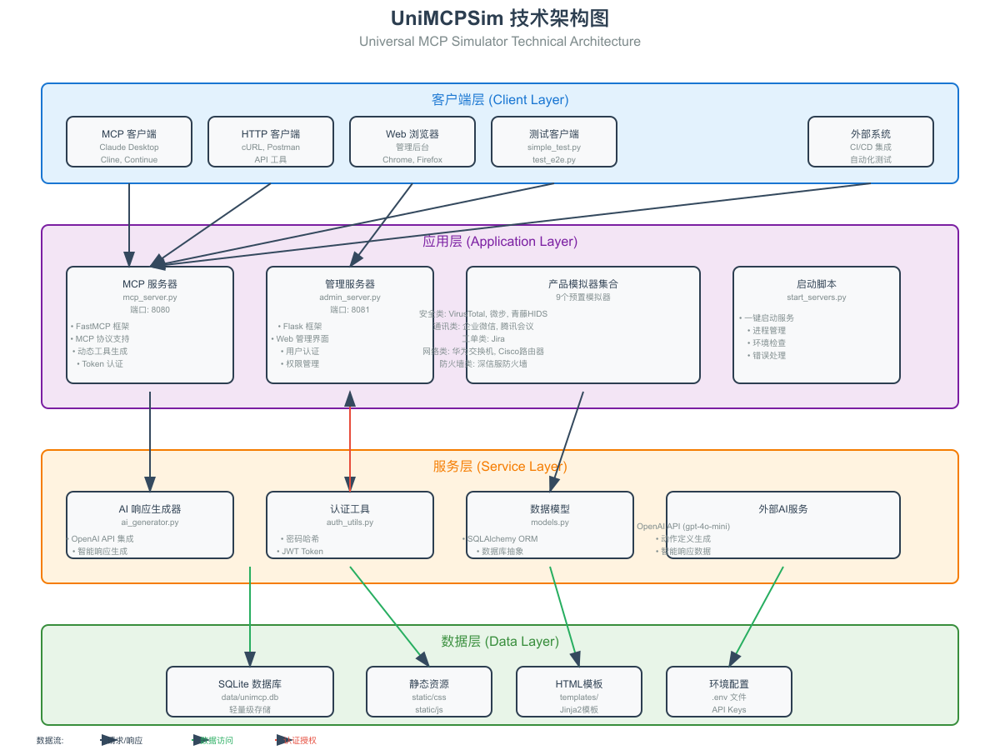
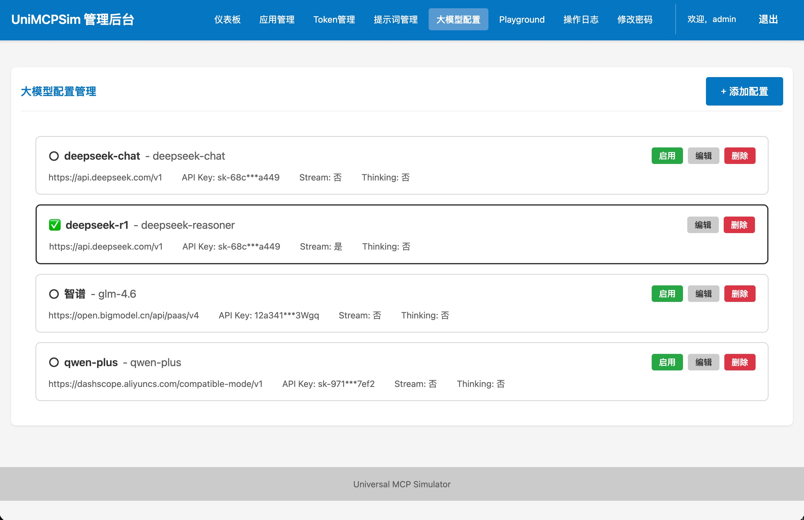
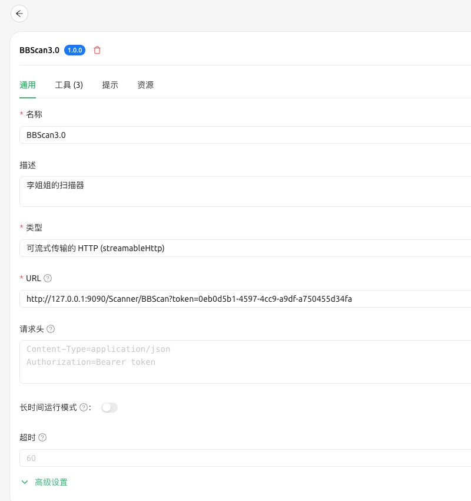
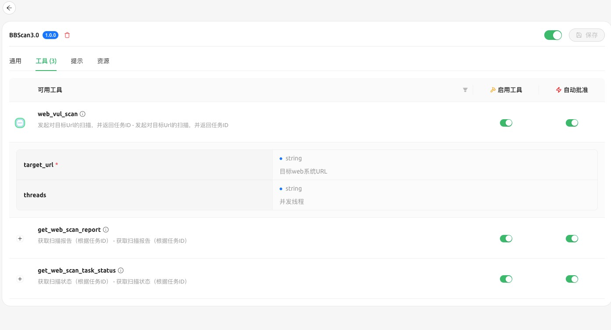
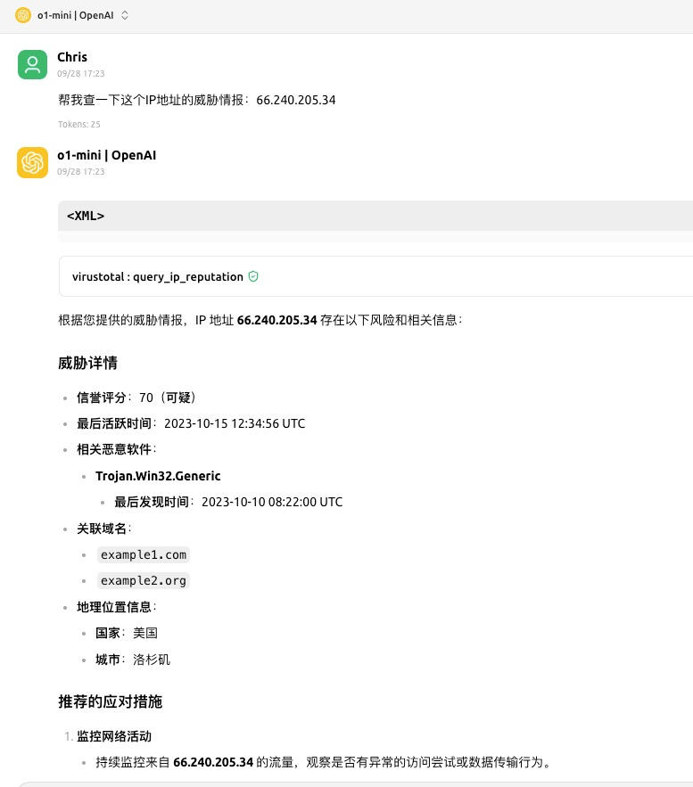
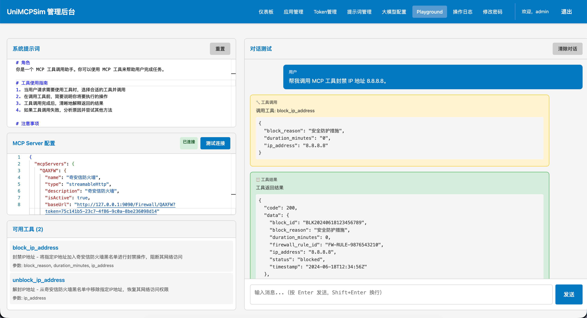
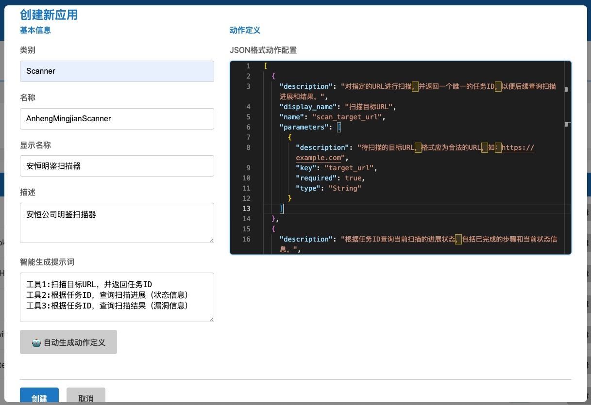
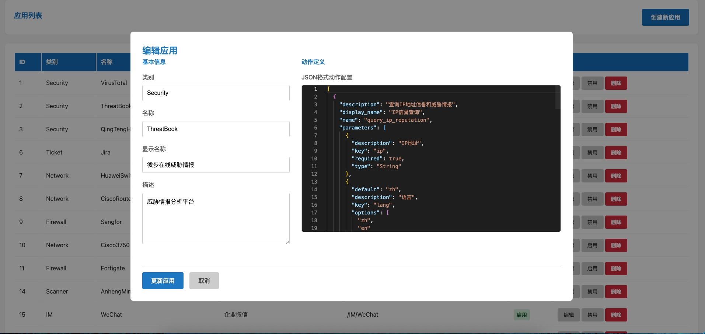

# UniMCPSim - 通用MCP模拟器

UniMCPSim是一个通用的MCP（Model Context Protocol）模拟器，可以动态模拟各种产品的API接口，为开发和测试提供便利。

## 🌟 主要特性

- **通用MCP模拟器**：基于FastMCP框架，支持标准MCP协议
- **多产品支持**：预置9个常用产品模拟器，涵盖安全、通讯、网络、工单等领域
- **MCP Playground** ⭐ NEW v2.9.0：交互式MCP测试工具，通过大模型对话验证MCP Server是否正常工作
- **AI增强响应**：兼容OpenAI API接口（支持OpenAI、Qwen、Deepseek、Claude、Gemini等），生成真实的模拟响应数据
- **智能动作生成**：基于数据库提示词模板，AI自动生成API动作定义
- **配置导入导出** (v2.8.0)：应用配置一键导入导出，支持批量迁移和备份
- **Web界面配置** (v2.6.0)：通过可视化界面配置大模型参数，无需手动编辑配置文件
- **增强日志系统**：详细记录所有MCP调用、AI调用、认证失败等，支持DEBUG模式
- **Web管理界面**：提供完整的Web后台管理系统
- **Token权限管理**：支持Token认证和细粒度权限控制
- **模板驱动**：支持自定义提示词模板，快速创建新的应用模拟器

## 📁 项目结构

```
UniMCPSim/
├── README.md                 # 项目说明文档
├── requirements.txt          # Python依赖包
├── mcp_server.py            # MCP服务器主程序
├── admin_server.py          # Web管理后台
├── models.py                # 数据库模型定义
├── auth_utils.py            # 认证工具
├── ai_generator.py          # AI响应生成器
├── mcp_client.py            # MCP客户端（Playground用）
├── playground_service.py    # Playground服务
├── logger_utils.py          # 增强日志系统
├── start_servers.py         # 服务启动脚本
├── data/                    # 数据目录
│   └── unimcp.db           # SQLite数据库 (自动创建)
├── logs/                    # 日志目录 (自动创建)
│   ├── unimcp_all.log      # 所有日志
│   ├── unimcp_error.log    # 错误日志
│   └── unimcp_debug.log    # DEBUG详细日志
├── static/                  # 静态资源
│   └── css/
│       └── main.css        # 统一CSS样式
├── templates/               # HTML模板
│   ├── _navigation.html     # 导航组件
│   ├── _footer.html         # 页脚组件
│   ├── login.html           # 登录页
│   ├── dashboard.html       # 仪表板
│   ├── apps.html            # 应用管理
│   ├── tokens.html          # Token管理
│   ├── prompts.html         # 提示词管理
│   ├── playground.html      # MCP Playground
│   ├── logs.html            # 审计日志
│   └── change_password.html # 密码修改
└── tests/                   # 测试文件
    ├── simple_test.py       # 核心功能测试
    └── test_e2e.py         # 端到端测试
├── docs/                    # 文档目录
│   └── images/              # 图片资源
│       ├── diagrams/        # 架构图
│       │   ├── technical-architecture.svg  # 技术架构图 (SVG格式)
│       │   └── technical-architecture.png  # 技术架构图 (PNG格式)
│       └── screenshots/     # 功能截图
```

## 🏗️ 系统架构

UniMCPSim采用分层架构设计，清晰划分各组件职责，确保系统的可扩展性和可维护性。



*技术架构图也提供 [SVG格式](docs/images/diagrams/technical-architecture.svg) 供高清查看*

### 架构层次

系统整体分为四个核心层次，各层之间通过标准化接口进行交互：

#### 1. **客户端层 (Client Layer)**
- **MCP客户端**: 支持Claude Desktop、Cline、Continue等标准MCP客户端
- **HTTP客户端**: 兼容cURL、Postman等REST API工具
- **Web浏览器**: 提供友好的管理界面访问
- **测试客户端**: 内置自动化测试脚本
- **外部系统**: 支持CI/CD集成和自动化流程

#### 2. **应用层 (Application Layer)**
- **MCP服务器** (`mcp_server.py`, 端口9090)
  - 基于FastMCP框架实现标准MCP协议
  - 支持动态工具注册和调用
  - 实现Token认证机制
  - 提供RESTful API接口

- **管理服务器** (`admin_server.py`, 端口9091)
  - 基于Flask框架构建
  - 提供Web管理界面
  - 用户认证和会话管理
  - 权限控制和审计功能

- **产品模拟器集合**: 预置9个高频使用场景的模拟器
- **启动脚本** (`start_servers.py`): 一键启动所有服务

#### 3. **服务层 (Service Layer)**
- **AI响应生成器** (`ai_generator.py`)
  - 兼容OpenAI API接口（支持OpenAI、Qwen、Deepseek、Claude、Gemini等）
  - 智能生成模拟响应数据
  - 基于提示词模板动态生成动作定义
  - 详细记录AI调用信息（耗时、token使用量等）

- **增强日志系统** (`logger_utils.py`)
  - 多层级日志文件（all/error/debug）
  - 详细记录MCP调用、AI调用、工具调用等
  - 支持DEBUG模式，记录完整调用详情
  - 日志自动轮转（10MB/文件，保留5个备份）

- **认证工具** (`auth_utils.py`)
  - 密码哈希和验证
  - JWT Token生成和验证
  - 会话管理

- **数据模型** (`models.py`)
  - SQLAlchemy ORM映射
  - 数据库抽象层
  - 业务实体定义

#### 4. **数据层 (Data Layer)**
- **SQLite数据库**: 轻量级本地存储，零配置
- **静态资源**: CSS/JavaScript文件
- **HTML模板**: Jinja2模板引擎
- **环境配置**: .env文件管理敏感配置

### 核心工作流程

1. **请求流程**: 客户端 → MCP服务器 → 服务层 → 数据层
2. **认证流程**: Token验证 → 权限检查 → 资源访问
3. **AI增强流程**: 请求解析 → 提示词构建 → OpenAI调用 → 响应格式化

### 技术优势

- **标准化协议**: 完整支持MCP协议规范，确保与各类MCP客户端的兼容性
- **模块化设计**: 各组件职责单一，便于独立开发和测试
- **AI驱动**: 利用大语言模型能力，动态生成真实的模拟数据
- **易于扩展**: 通过Web界面或配置文件即可添加新的模拟器
- **零依赖部署**: SQLite数据库无需额外配置，开箱即用

## 🚀 快速开始

### 1. 环境准备

确保已安装Python 3.8+

```bash
# 克隆项目
git clone <repository-url>
cd UniMCPSim

# 创建虚拟环境
python -m venv venv

# 激活虚拟环境
# Linux/Mac:
source venv/bin/activate
# Windows:
venv\Scripts\activate

# 安装依赖
pip install -r requirements.txt

# 设置环境变量（重要！）
unset HTTPS_PROXY
unset HTTP_PROXY
```

### 2. 环境变量配置

**推荐方式：** 通过Web界面配置大模型（v2.6.0+）

从 v2.6.0 开始，您可以通过 Web 管理界面配置大模型参数，无需手动编辑 `.env` 文件：

1. 启动服务后访问：http://localhost:9091/admin/
2. 登录（默认：admin / admin123）
3. 点击"大模型配置"菜单
4. 填写配置并点击"测试连接"验证
5. 保存配置即可使用

**v2.11.0+ 多配置管理：** 支持预注册多个大模型配置，一键切换活跃配置，配置热切换无需重启服务。



**传统方式：** 通过 `.env` 文件配置（可选，向后兼容）

如果您更喜欢使用配置文件，也可以创建 `.env` 文件：

```bash
# 创建.env文件
cat > .env << 'EOF'
# ===== AI大模型配置 =====
# 注意：v2.6.0+ 推荐通过Web界面配置，此处配置为备用方式
# 配置优先级：数据库配置（Web界面）> .env文件

# AI API配置（可选 - 推荐通过Web界面配置）
# 支持OpenAI、Qwen、Deepseek、Claude、Gemini等所有兼容OpenAI API的服务
OPENAI_API_KEY=your_api_key_here
OPENAI_MODEL=gpt-4o-mini
OPENAI_API_BASE_URL=https://api.openai.com/v1
OPENAI_ENABLE_THINKING=false  # 禁用思考模式,防止影响JSON输出(默认false)
OPENAI_STREAM=false  # 控制stream模式,某些模型如qwq-32b强制要求true(默认false)

# ===== 服务端口配置 =====
MCP_SERVER_PORT=9090
ADMIN_SERVER_PORT=9091

# ===== 日志配置 =====
DEBUG=false              # 启用DEBUG模式记录详细调用信息
LOG_LEVEL=INFO          # 日志级别: DEBUG, INFO, WARNING, ERROR
LOG_DIR=logs            # 日志文件存储目录
EOF
```

**配置优先级说明（v2.6.0+）：**
- 🥇 **数据库配置**（通过Web界面设置）- 最高优先级
- 🥈 **`.env` 文件**（传统方式）- 备用方案

⚠️ **注意**：
- v2.6.0+ 推荐使用Web界面配置大模型（更安全、更方便）
- 如果数据库中已有配置，将优先使用数据库配置
- `.env` 文件作为备用方案，确保向后兼容
- 支持任何兼容OpenAI API接口的服务（OpenAI、Qwen、Deepseek、Claude、Gemini等）
- 如果没有配置AI API，新建应用的AI辅助生成功能将无法使用
- 启用`DEBUG=true`可记录完整的调用详情，包括完整token、headers、AI prompt等（仅用于排查问题）

**OPENAI_ENABLE_THINKING配置说明**：
- 默认值: `false` (禁用thinking模式)
- 用途: 控制大模型是否启用思考过程输出
- 重要性: 许多支持thinking模式的大模型(如qwen-thinking、DeepSeek-R1、QwQ等)在启用thinking时会在响应中包含思考过程,这会干扰JSON格式的解析,导致API响应生成失败
- 建议: 保持默认值`false`,除非你明确知道使用的模型不会因thinking模式影响JSON输出
- 设置为`true`: 仅在需要调试或使用特定模型时启用

**OPENAI_STREAM配置说明**：
- 默认值: `false` (禁用stream模式)
- 用途: 控制是否使用stream模式调用AI API
- 重要性: 某些模型(如qwq-32b)强制要求使用stream模式,否则会返回400错误:"This model only support stream mode"
- 适用模型: qwq-32b、部分deepseek-r1变体等
- 建议: 根据使用的模型调整
  - 常规模型(gpt-4o-mini、qwen3-max等): 保持`false`
  - 强制stream模型(qwq-32b等): 设置为`true`
- 注意: Stream模式下无法获取token使用量统计信息

### 3. 启动服务

#### 方式一：一键启动（推荐）
```bash
python start_servers.py
```

#### 方式二：分别启动
```bash
# 启动MCP服务器（端口9090）
python mcp_server.py

# 启动Web管理后台（端口9091）
python admin_server.py
```

看到以下输出表示启动成功：
```
==========================================================
UniMCPSim - Universal MCP Simulator
==========================================================

初始化默认模拟器...
✅ 已创建默认管理员用户

启动服务...
服务已启动:
----------------------------------------------------------
MCP服务器: http://localhost:9090
管理后台: http://localhost:9091/admin/
默认账号: admin / admin123
----------------------------------------------------------

按 Ctrl+C 停止服务
```

### 4. 访问服务

启动成功后，可以访问以下服务：

- **MCP服务器**: http://localhost:9090
- **Web管理后台**: http://localhost:9091/admin/
- **默认管理员账号**:
  - 用户名: `admin`
  - 密码: `admin123`

## 🧪 功能验证测试

### 1. 测试核心功能

打开新终端，运行功能测试：

```bash
cd UniMCPSim
source venv/bin/activate
unset HTTPS_PROXY && unset HTTP_PROXY

# 运行核心功能测试
python tests/simple_test.py
```

期望输出：
```
############################################################
# UniMCPSim 功能验证测试
############################################################

============================================================
测试应用列表功能
============================================================
✅ 找到 9 个已启用的应用:
   - VirusTotal威胁情报 (/Security/VirusTotal)
   - 微步在线威胁情报 (/Security/ThreatBook)
   - 青藤云HIDS (/Security/QingTengHIDS)
   - 企业微信 (/IM/WeChat)
   - 腾讯会议 (/Meeting/TencentMeeting)
   - Jira工单系统 (/Ticket/Jira)
   - 华为交换机 (/Network/HuaweiSwitch)
   - Cisco路由器 (/Network/CiscoRouter)
   - 深信服防火墙 (/Firewall/Sangfor)

============================================================
UniMCPSim 核心功能测试
============================================================
✅ 使用Token: dbb02af0...a525

测试 1: 企业微信发送消息 ✅ 成功
测试 2: VirusTotal IP扫描 ✅ 成功
测试 3: Jira创建工单 ✅ 成功
测试 4: 深信服防火墙封禁IP ✅ 成功
测试 5: 华为交换机查看接口 ✅ 成功

============================================================
测试总结
============================================================
🎉 所有测试通过!
```

### 2. Web管理后台验证

浏览器访问：http://localhost:9091/admin/

- 用户名：`admin`
- 密码：`admin123`

可以查看：
- 📊 系统概览
- 🔧 应用管理
- 🎫 Token管理
- 📋 审计日志

### 3. API接口测试

```bash
# 获取Demo Token - 方法1：从管理后台复制
# 访问 http://localhost:9091/admin/tokens 复制Demo Token

# 获取Demo Token - 方法2：使用脚本
TOKEN=$(python -c "
import sys
sys.path.append('.')
from models import db_manager, Token
session = db_manager.get_session()
try:
    demo_token = session.query(Token).filter_by(name='Demo Token').first()
    if demo_token:
        print(demo_token.token)
finally:
    session.close()
")

# 测试企业微信发送消息
curl "http://localhost:9090/IM/WeChat?token=$TOKEN" \
  -H "Content-Type: application/json" \
  -d '{
    "action": "send_text_message",
    "parameters": {
      "to_user": "test_user",
      "content": "Hello from UniMCPSim!"
    }
  }'
```

## 🔧 配置说明

### 预置模拟器列表

系统预置了以下9个产品模拟器：

| 分类 | 产品名称 | 路径 | 功能描述 |
|------|----------|------|----------|
| Security | VirusTotal威胁情报 | `/Security/VirusTotal` | IP/域名威胁检测 |
| Security | 微步在线威胁情报 | `/Security/ThreatBook` | 威胁情报查询 |
| Security | 青藤云HIDS | `/Security/QingTengHIDS` | 主机入侵检测 |
| IM | 企业微信 | `/IM/WeChat` | 企业即时通讯 |
| Meeting | 腾讯会议 | `/Meeting/TencentMeeting` | 视频会议管理 |
| Ticket | Jira工单系统 | `/Ticket/Jira` | 工单管理 |
| Network | 华为交换机 | `/Network/HuaweiSwitch` | 网络设备管理 |
| Network | Cisco路由器 | `/Network/CiscoRouter` | 路由器配置 |
| Firewall | 深信服防火墙 | `/Firewall/Sangfor` | 防火墙策略管理 |

### API使用示例

#### 企业微信发送消息示例
```bash
# 获取Demo Token (在管理后台获取或使用脚本)
TOKEN="demo-token-here"

# 直接调用企业微信API端点
curl "http://localhost:9090/IM/WeChat?token=$TOKEN" \
  -H "Content-Type: application/json" \
  -d '{
    "action": "send_text_message",
    "parameters": {
      "to_user": "test_user",
      "content": "Hello from UniMCPSim!"
    }
  }'
```

#### 其他产品示例

**VirusTotal IP扫描**
```bash
curl "http://localhost:9090/Security/VirusTotal?token=$TOKEN" \
  -H "Content-Type: application/json" \
  -d '{
    "action": "scan_ip",
    "parameters": {
      "ip": "8.8.8.8"
    }
  }'
```

**Jira创建工单**
```bash
curl "http://localhost:9090/Ticket/Jira?token=$TOKEN" \
  -H "Content-Type: application/json" \
  -d '{
    "action": "create_issue",
    "parameters": {
      "project_key": "TEST",
      "issue_type": "Task",
      "summary": "测试工单",
      "description": "这是一个测试工单",
      "priority": "High"
    }
  }'
```

**深信服防火墙封禁IP**
```bash
curl "http://localhost:9090/Firewall/Sangfor?token=$TOKEN" \
  -H "Content-Type: application/json" \
  -d '{
    "action": "block_ip_address",
    "parameters": {
      "ip_address": "192.168.1.100",
      "reason": "可疑活动"
    }
  }'
```

## 📚 MCP客户端接入指南

### Cherry Studio 集成示例

UniMCPSim 完美支持 Cherry Studio 等 MCP 客户端，以下是详细的集成步骤：

#### 1. 在 Cherry Studio 中创建 MCP 服务器



在 Cherry Studio 中：
1. 打开设置页面
2. 选择 "MCP 服务器" 选项
3. 点击 "添加新服务器"

#### 2. 配置 UniMCPSim 服务器

配置参数：
- **服务器名称**: UniMCPSim
- **服务器地址**: `http://localhost:9090/{Category}/{Product}?token={your-token}`
- **协议**: HTTP
- **认证**: Token认证

示例配置：
- 企业微信: `http://localhost:9090/IM/WeChat?token=your-demo-token`
- 威胁情报: `http://localhost:9090/Security/VirusTotal?token=your-demo-token`

#### 3. 查看可用工具列表



配置成功后，Cherry Studio 会自动识别 UniMCPSim 提供的所有工具：
- ✅ 企业微信消息发送
- ✅ 威胁情报查询
- ✅ 工单管理
- ✅ 网络设备控制
- ✅ 防火墙策略管理

#### 4. 在对话中使用 MCP 工具



在 Cherry Studio 的对话界面中：
1. 自然语言描述需求
2. AI自动选择合适的工具
3. 执行具体操作
4. 获取真实的模拟响应

### MCP Playground 测试工具 ⭐ NEW v2.9.0

UniMCPSim v2.9.0 新增 MCP Playground 功能，无需外部客户端即可直接在 Web 界面中测试 MCP Server。



#### 功能特点

- **可视化配置**: 通过 JSON 编辑器配置任意 MCP Server
- **实时连接测试**: 一键测试连接并查看可用工具列表
- **AI 对话交互**: 通过自然语言与大模型对话，自动调用 MCP 工具
- **工具调用可视化**: 实时显示工具调用过程和返回结果
- **自定义系统提示词**: 可编辑系统提示词控制 AI 行为

#### 使用方法

1. 登录管理后台，点击导航栏的"MCP Playground"
2. 在左侧配置区粘贴 MCP Server 配置（JSON 格式）
3. 点击"测试连接"验证配置并获取工具列表
4. 在右侧对话区输入指令，AI 将自动调用相应的 MCP 工具

#### MCP 配置示例

```json
{
  "mcpServers": {
    "QAXFW": {
      "name": "奇安信防火墙",
      "type": "streamableHttp",
      "description": "奇安信防火墙MCP服务",
      "isActive": true,
      "baseUrl": "http://127.0.0.1:9090/Firewall/QAXFW?token=YOUR_TOKEN_HERE"
    }
  }
}
```

#### 适用场景

- 🔧 快速验证新建的 MCP Server 是否正常工作
- 🧪 测试 MCP 工具的参数和返回值
- 📚 学习和了解 MCP 协议的工作方式
- 🔍 调试 MCP 工具调用问题

## 🛠️ 管理后台使用指南

### Web管理界面功能

1. **登录系统**
   - 访问 http://localhost:9091/admin/
   - 使用默认账号登录（admin / admin123）

2. **仪表板**
   - 查看系统运行状态和统计信息
   - 监控应用数量、Token数量、今日调用量
   - 显示系统启动时间和健康状态

3. **应用管理** ⭐ 增强功能
   - 查看所有可用应用列表
   - 创建新的应用模拟器
   - 编辑应用配置和动作定义
   - **点击应用名称查看详细信息**：完整的应用信息和动作列表
   - **一键生成MCP配置**：自动生成标准MCP客户端配置，支持复制到Cherry Studio、Claude Desktop或Cline
   - **配置导入导出** (v2.8.0)：
     - 📤 **导出**：支持导出全部应用或选择性导出指定应用，自动生成时间戳文件名
     - 📥 **导入**：从JSON文件导入应用配置，导入前预览新建/覆盖应用列表
     - 自动识别同名应用（按category+name匹配）并直接覆盖
     - 完整的JSON格式验证和友好错误提示
     - 导入成功后提醒手动设置Token权限
   - 使用AI自动生成动作定义

4. **Token管理** ⭐ 增强功能
   - 创建新的访问Token
   - **可视化权限管理**：通过模态框查看和编辑Token权限
   - **批量权限设置**：全选/取消全选功能，快速配置应用访问权限
   - 查看Token使用记录和授权应用数量
   - 启用/禁用Token

5. **提示词管理**
   - 管理AI生成提示词模板
   - 自定义动作生成和响应模拟模板
   - 支持系统变量（app_name, action_name等）

6. **审计日志**
   - 查看所有API调用记录
   - 监控系统使用情况
   - 追踪操作历史

7. **账户管理**
   - 修改管理员密码
   - 安全退出

#### 创建新应用示例

以下是在管理后台创建新应用的截图示例：


*创建安恒网络安全扫描器应用*


*创建微步在线威胁情报应用*

通过Web界面可以轻松：
- 📝 填写应用基本信息
- 🔧 配置API动作定义
- 🤖 使用AI自动生成动作
- ✅ 实时验证配置

3. **Token管理**
   - 创建新的访问Token
   - 配置Token权限
   - 查看Token使用记录

4. **审计日志**
   - 查看所有API调用记录
   - 监控系统使用情况

### 添加新的模拟器

#### 通过Web管理界面添加（推荐）

1. 访问 http://localhost:9091/admin/
2. 登录管理后台
3. 进入"应用管理"页面
4. 点击"创建新应用"按钮
5. 填写应用信息：
   - 应用名称（英文）
   - 显示名称（中文）
   - 分类
   - 描述
6. 配置动作定义或使用AI自动生成

#### 动作定义格式

在创建应用时，动作定义使用以下JSON格式：

```json
[
  {
    "name": "your_action",
    "display_name": "动作显示名称",
    "description": "动作描述",
    "parameters": [
      {
        "key": "param_name",
        "type": "String",
        "required": true,
        "description": "参数描述"
      }
    ]
  }
]
```

#### 访问新的模拟器

创建完成后，即可通过以下URL访问：
```
http://localhost:9090/{Category}/{ProductName}?token=<your-token>
```

## 🎯 MCP协议详细使用说明

### MCP服务器地址

#### 产品特定端点（推荐）

**URL格式**: `http://localhost:9090/<Category>/<Product>?token=<your-token>`

**示例端点**:
- 企业微信: `http://localhost:9090/IM/WeChat?token=<your-token>`
- 华为交换机: `http://localhost:9090/Network/HuaweiSwitch?token=<your-token>`
- 深信服防火墙: `http://localhost:9090/Firewall/Sangfor?token=<your-token>`

### 完整MCP使用示例

#### 步骤1：初始化MCP连接

```bash
curl -X POST "http://localhost:9090/IM/WeChat?token=f1bb3770-6e46-4fe6-b518-e1c738c7b6a4" \
  -H "Content-Type: application/json" \
  -H "Accept: application/json, text/event-stream" \
  -d '{
    "jsonrpc": "2.0",
    "method": "initialize",
    "params": {
      "protocolVersion": "0.1.0",
      "capabilities": {},
      "clientInfo": {
        "name": "demo-client",
        "version": "1.0.0"
      }
    },
    "id": 1
  }' \
  -D headers.txt
```

**响应示例**:
```
event: message
data: {
  "jsonrpc": "2.0",
  "id": 1,
  "result": {
    "protocolVersion": "2025-06-18",
    "capabilities": {
      "experimental": {},
      "prompts": {"listChanged": true},
      "resources": {"subscribe": false, "listChanged": true},
      "tools": {"listChanged": true}
    },
    "serverInfo": {
      "name": "UniMCPSim",
      "version": "1.0.0"
    },
    "instructions": "Universal MCP Simulator - 通用MCP模拟器，可动态模拟各种产品的API接口"
  }
}
```

**重要**: 从响应头中提取`mcp-session-id`：
```bash
session_id=$(grep -i 'mcp-session-id:' headers.txt | tr -d '\r' | cut -d' ' -f2-)
echo "会话ID: $session_id"
```

#### 步骤2：企业微信发送消息示例

```bash
# 使用提取的会话ID
curl -X POST "http://localhost:9090/IM/WeChat?token=f1bb3770-6e46-4fe6-b518-e1c738c7b6a4" \
  -H "Content-Type: application/json" \
  -H "Accept: application/json, text/event-stream" \
  -H "mcp-session-id: $session_id" \
  -d '{
    "jsonrpc": "2.0",
    "method": "tools/call",
    "params": {
      "name": "execute_action",
      "arguments": {
        "token": "f1bb3770-6e46-4fe6-b518-e1c738c7b6a4",
        "category": "IM",
        "product": "WeChat",
        "action": "send_message",
        "parameters": {
          "to_user": "zhang.san",
          "text": "项目会议将于明天下午2点在A会议室举行，请准时参加。"
        }
      }
    },
    "id": 2
  }'
```

### Python客户端示例

```python
import asyncio
import httpx
import json

class UniMCPSimClient:
    def __init__(self, base_url="http://localhost:9090", token=None, product_path=None):
        self.base_url = base_url
        self.token = token
        self.product_path = product_path  # 例如: "IM/WeChat"
        self.session_id = None

    @property
    def endpoint_url(self):
        """获取完整的端点URL"""
        if self.product_path:
            return f"{self.base_url}/{self.product_path}"
        else:
            return f"{self.base_url}/mcp"

    async def initialize(self):
        """初始化MCP连接"""
        async with httpx.AsyncClient() as client:
            payload = {
                "jsonrpc": "2.0",
                "method": "initialize",
                "params": {
                    "protocolVersion": "0.1.0",
                    "capabilities": {},
                    "clientInfo": {"name": "python-client", "version": "1.0.0"}
                },
                "id": 1
            }

            response = await client.post(
                f"{self.endpoint_url}?token={self.token}",
                json=payload,
                headers={
                    "Content-Type": "application/json",
                    "Accept": "application/json, text/event-stream"
                }
            )

            # 提取会话ID
            self.session_id = response.headers.get('mcp-session-id')
            return response.status_code == 200

    async def execute_action(self, category, product, action, parameters):
        """执行模拟器动作"""
        if not self.session_id:
            raise Exception("请先调用initialize()初始化连接")

        async with httpx.AsyncClient() as client:
            payload = {
                "jsonrpc": "2.0",
                "method": "tools/call",
                "params": {
                    "name": "execute_action",
                    "arguments": {
                        "token": self.token,
                        "category": category,
                        "product": product,
                        "action": action,
                        "parameters": parameters
                    }
                },
                "id": 2
            }

            response = await client.post(
                f"{self.endpoint_url}?token={self.token}",
                json=payload,
                headers={
                    "Content-Type": "application/json",
                    "Accept": "application/json, text/event-stream",
                    "mcp-session-id": self.session_id
                }
            )

            return response.text

# 使用示例
async def main():
    # 使用产品特定端点（推荐）
    client = UniMCPSimClient(
        token="f1bb3770-6e46-4fe6-b518-e1c738c7b6a4",
        product_path="IM/WeChat"
    )

    # 初始化连接
    if await client.initialize():
        print("✅ MCP连接初始化成功")

        # 企业微信发送消息
        result = await client.execute_action(
            category="IM",
            product="WeChat",
            action="send_message",
            parameters={
                "to_user": "zhang.san",
                "text": "Python客户端测试消息"
            }
        )
        print("发送消息结果:", result)
    else:
        print("❌ MCP连接初始化失败")

# 运行示例
if __name__ == "__main__":
    asyncio.run(main())
```

## 🧪 测试

### 核心功能测试

```bash
# 运行核心功能测试
python tests/simple_test.py
```

测试内容包括：
- ✅ 应用列表功能
- ✅ 企业微信发送消息
- ✅ VirusTotal IP扫描
- ✅ Jira创建工单
- ✅ 深信服防火墙封禁IP
- ✅ 华为交换机查看接口

### 端到端测试

```bash
# 运行端到端测试（需要服务器运行）
python tests/test_e2e.py
```

### 一键测试脚本

创建文件 `test_wechat.sh`：

```bash
#!/bin/bash

# 设置变量
MCP_SERVER="http://localhost:9090/IM/WeChat"
TOKEN="f1bb3770-6e46-4fe6-b518-e1c738c7b6a4"

echo "=== UniMCPSim 企业微信测试 ==="

# 步骤1：初始化连接
echo "1. 初始化MCP连接..."
init_response=$(curl -s -X POST "${MCP_SERVER}?token=${TOKEN}" \
  -H "Content-Type: application/json" \
  -H "Accept: application/json, text/event-stream" \
  -d '{
    "jsonrpc": "2.0",
    "method": "initialize",
    "params": {
      "protocolVersion": "0.1.0",
      "capabilities": {},
      "clientInfo": {"name": "test-client", "version": "1.0.0"}
    },
    "id": 1
  }' \
  -D /tmp/headers.txt)

# 提取会话ID
session_id=$(grep -i 'mcp-session-id:' /tmp/headers.txt | tr -d '\r' | cut -d' ' -f2-)

if [ -z "$session_id" ]; then
    echo "❌ 获取会话ID失败"
    exit 1
fi

echo "✅ 连接成功，会话ID: $session_id"

# 步骤2：发送消息
echo ""
echo "2. 测试企业微信发送消息..."
msg_response=$(curl -s -X POST "${MCP_SERVER}?token=${TOKEN}" \
  -H "Content-Type: application/json" \
  -H "Accept: application/json, text/event-stream" \
  -H "mcp-session-id: $session_id" \
  -d '{
    "jsonrpc": "2.0",
    "method": "tools/call",
    "params": {
      "name": "execute_action",
      "arguments": {
        "token": "'$TOKEN'",
        "category": "IM",
        "product": "WeChat",
        "action": "send_message",
        "parameters": {
          "to_user": "test.user",
          "text": "这是一条测试消息"
        }
      }
    },
    "id": 2
  }')

if echo "$msg_response" | grep -q "event: message"; then
    echo "✅ 消息发送成功"
    echo "$msg_response" | grep "data:" | sed 's/data: //'
else
    echo "❌ 消息发送失败"
    echo "$msg_response"
fi

echo ""
echo "=== 测试完成 ==="
```

使用方法：
```bash
chmod +x test_wechat.sh
./test_wechat.sh
```

## 🔍 故障排除

### 常见问题

1. **端口被占用**
```bash
# 检查端口占用
lsof -i :9090
lsof -i :9091

# 杀死占用进程
kill -9 <PID>
```

2. **依赖安装失败**
```bash
# 升级pip
pip install --upgrade pip

# 清除缓存重新安装
pip cache purge
pip install -r requirements.txt
```

3. **数据库错误**
```bash
# 完全重置
rm -rf data/
mkdir data
python init_simulators.py
```

4. **网络代理干扰**
```bash
# 确保取消代理设置
unset HTTPS_PROXY
unset HTTP_PROXY
unset http_proxy
unset https_proxy

# 验证
echo $HTTPS_PROXY  # 应该为空
```

### 调试和故障排除

#### 常见错误

1. **HTTP 406 Not Acceptable**
   - 缺少正确的Accept头
   - 解决：添加 `Accept: application/json, text/event-stream`

2. **HTTP 400 Bad Request: Missing session ID**
   - 未先进行initialize或session ID丢失
   - 解决：先调用initialize方法获取session ID

3. **HTTP 401 Unauthorized**
   - Token无效或已过期
   - 解决：检查Token是否正确

4. **工具调用返回error**
   - 参数不正确或缺少必填参数
   - 解决：检查API文档确认参数格式

#### 查看详细日志

启动服务器时可以看到详细的请求日志：
```bash
python mcp_server.py
```

#### 获取可用Token

```bash
# 通过Web管理后台
curl "http://localhost:9091/admin/api/tokens" -H "Authorization: Bearer <session>"

# 或直接查询数据库
python -c "
from models import db_manager, Token
session = db_manager.get_session()
tokens = session.query(Token).filter_by(enabled=True).all()
for token in tokens:
    print(f'{token.name}: {token.token}')
session.close()
"
```

### 常用操作

#### 重启服务
```bash
# 停止服务 (Ctrl+C)
# 重新启动
python start_servers.py
```

#### 重置数据库
```bash
# 删除现有数据库
rm -f data/unimcp.db

# 重新初始化
python init_simulators.py
```

## 🎯 成功标志

看到以下输出表示系统运行正常：

1. **服务启动成功**：
   - MCP服务器运行在9090端口
   - Web管理后台运行在9091端口
   - 无错误日志输出

2. **功能测试通过**：
   - `python tests/simple_test.py` 显示 "🎉 所有测试通过!"
   - 9个应用模拟器全部可用
   - Demo Token正常工作

3. **Web界面正常**：
   - 能够正常登录管理后台
   - 各个页面加载正常
   - 数据显示正确

## 🔧 开发说明

### 技术栈

- **后端框架**: FastMCP (MCP服务) + Flask (Web管理)
- **数据库**: SQLite + SQLAlchemy ORM
- **AI集成**: OpenAI API
- **前端**: HTML + CSS + JavaScript (原生)
- **认证**: JWT Token + 会话管理

### 扩展开发

1. **添加新的MCP工具**
```python
@mcp.tool()
async def your_new_tool(param1: str, param2: int) -> str:
    """工具描述"""
    # 实现逻辑
    return "result"
```

2. **自定义AI响应模板**
编辑 `ai_generator.py` 中的响应模板

3. **添加新的Web页面**
在 `templates/` 目录添加HTML模板，在 `admin_server.py` 添加路由

## 📊 日志系统

UniMCPSim v2.3+ 引入了增强的日志系统，帮助您更好地诊断和监控系统运行。

### 日志文件

所有日志文件存储在 `logs/` 目录（可通过环境变量 `LOG_DIR` 自定义）：

- **`unimcp_all.log`** - 所有日志（INFO及以上级别）
  - 记录所有成功和失败的请求
  - 包含基本的调用信息（路径、方法、token前8位等）
  - 适合日常监控和审计

- **`unimcp_error.log`** - 错误日志
  - 只记录错误和警告
  - 快速定位问题
  - 包含详细的错误堆栈信息

- **`unimcp_debug.log`** - DEBUG详细日志（仅在DEBUG模式下生成）
  - 记录完整的调用详情
  - 包含完整token、HTTP headers、完整请求/响应内容
  - AI调用的完整prompt和response
  - 数据库操作详情
  - 仅用于排查复杂问题

### 记录内容

#### 1. MCP Server调用
```
2025-09-30 16:05:12 - INFO - MCP Request: POST:tools/list /ThreatIntelligence/Threatbook - SUCCESS
```
记录信息：
- 请求方法和MCP方法名
- 应用路径
- Token（默认只记录前8位）
- 请求参数
- 是否成功
- 错误信息（如果失败）

#### 2. AI模型调用
```
2025-09-30 16:10:30 - INFO - AI Call: OpenAI/qwen3-max - SUCCESS (duration: 1.23s)
```
记录信息：
- AI提供商和模型
- 调用耗时
- Token使用量（prompt_tokens、completion_tokens）
- DEBUG模式下记录完整的prompt和response

#### 3. 工具调用
```
2025-09-30 16:12:15 - INFO - Tool Call: query_ip_threat_intel (app: ThreatIntelligence/Threatbook) - SUCCESS
```
记录信息：
- 工具名称
- 所属应用
- 参数
- 执行结果
- 错误信息（如果失败）

#### 4. 认证失败
```
2025-09-30 16:15:00 - WARNING - Auth Failure: Token required (path: /IM/WeChat, ip: 127.0.0.1)
```
记录信息：
- 失败原因
- 访问路径
- 客户端IP
- Token信息（如有）

### DEBUG模式

启用DEBUG模式可记录更详细的诊断信息：

```bash
# 在 .env 文件中设置
DEBUG=true
LOG_LEVEL=DEBUG
```

DEBUG模式额外记录：
- ✅ 完整的API Token（非DEBUG只记录前8位）
- ✅ 完整的HTTP Headers
- ✅ 完整的请求和响应内容
- ✅ AI调用的完整prompt和response
- ✅ 数据库操作详情

⚠️ **安全提醒**：
- DEBUG模式会记录敏感信息（token、prompt等），仅在开发和排查问题时启用
- 生产环境请使用 `DEBUG=false`
- 日志文件已自动添加到 `.gitignore`，不会被提交到版本控制

### 日志轮转

日志系统自动进行文件轮转：
- 单个日志文件最大 10MB
- 保留最近 5 个备份文件
- 自动压缩和清理旧日志

### 使用场景

1. **监控MCP调用**
   ```bash
   # 实时查看所有请求
   tail -f logs/unimcp_all.log

   # 只看错误
   tail -f logs/unimcp_error.log
   ```

2. **排查Cherry Studio调用问题**
   - 启用DEBUG模式
   - 查看 `unimcp_debug.log` 中的完整headers和session ID
   - 确认是否真正调用了MCP Server

3. **诊断AI响应问题**
   - 启用DEBUG模式
   - 查看AI调用的完整prompt和response
   - 检查token使用量和耗时

4. **审计和安全**
   - 查看认证失败记录
   - 追踪特定token的使用情况
   - 监控异常访问模式

## 🤝 贡献

欢迎提交Issue和Pull Request来改进项目！

## 📄 许可证

本项目采用MIT许可证 - 查看 [LICENSE](LICENSE) 文件了解详情

## 📞 支持

如有问题或建议，请：
- 提交GitHub Issue
- 联系项目维护者

---

**UniMCPSim** - 让API模拟变得简单高效！🚀

现在您可以：
- 🔌 通过MCP协议连接各种客户端如Cherry Studio
- 🌐 使用Web界面管理应用和Token
- 🧪 开发和测试需要多种API的应用
- 🔧 根据需要添加自定义模拟器
- 🤖 利用AI智能生成真实的模拟响应