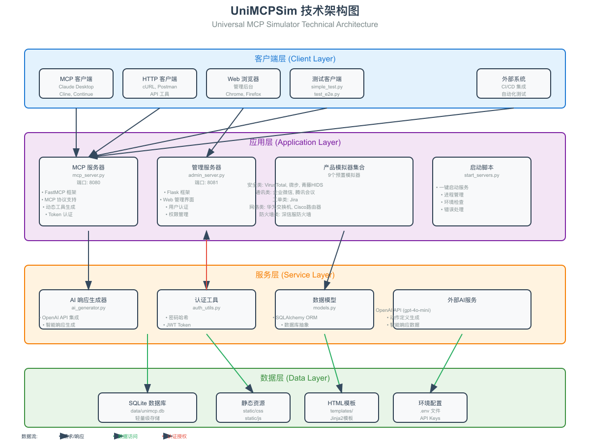

# UniMCPSim - 通用MCP模拟器

UniMCPSim是一个通用的MCP（Model Context Protocol）模拟器，可以动态模拟各种产品的API接口，为开发和测试提供便利。

## 🌟 主要特性

- **通用MCP模拟器**：基于FastMCP框架，支持标准MCP协议
- **多产品支持**：预置9个常用产品模拟器，涵盖安全、通讯、网络、工单等领域
- **AI增强响应**：集成OpenAI API，生成真实的模拟响应数据
- **智能动作生成**：基于数据库提示词模板，AI自动生成API动作定义
- **Web管理界面**：提供完整的Web后台管理系统
- **Token权限管理**：支持Token认证和细粒度权限控制
- **模板驱动**：支持自定义提示词模板，快速创建新的应用模拟器

## 📁 项目结构

```
UniMCPSim/
├── README.md                 # 项目说明文档
├── requirements.txt          # Python依赖包
├── mcp_server.py            # MCP服务器主程序
├── admin_server.py          # Web管理后台
├── models.py                # 数据库模型定义
├── auth_utils.py            # 认证工具
├── ai_generator.py          # AI响应生成器
├── start_servers.py         # 服务启动脚本
├── data/                    # 数据目录
│   └── unimcp.db           # SQLite数据库 (自动创建)
├── static/                  # 静态资源
│   └── css/
│       └── main.css        # 统一CSS样式
├── templates/               # HTML模板
│   ├── login.html
│   ├── dashboard.html
│   ├── apps.html
│   └── tokens.html
└── tests/                   # 测试文件
    ├── simple_test.py       # 核心功能测试
    └── test_e2e.py         # 端到端测试
├── docs/                    # 文档目录
│   ├── technical-architecture.svg  # 技术架构图 (SVG格式)
│   └── technical-architecture.png  # 技术架构图 (PNG格式)
```

## 🏗️ 系统架构

UniMCPSim采用分层架构设计，清晰划分各组件职责，确保系统的可扩展性和可维护性。



*技术架构图也提供 [SVG格式](docs/technical-architecture.svg) 供高清查看*

### 架构层次

系统整体分为四个核心层次，各层之间通过标准化接口进行交互：

#### 1. **客户端层 (Client Layer)**
- **MCP客户端**: 支持Claude Desktop、Cline、Continue等标准MCP客户端
- **HTTP客户端**: 兼容cURL、Postman等REST API工具
- **Web浏览器**: 提供友好的管理界面访问
- **测试客户端**: 内置自动化测试脚本
- **外部系统**: 支持CI/CD集成和自动化流程

#### 2. **应用层 (Application Layer)**
- **MCP服务器** (`mcp_server.py`, 端口8080)
  - 基于FastMCP框架实现标准MCP协议
  - 支持动态工具注册和调用
  - 实现Token认证机制
  - 提供RESTful API接口

- **管理服务器** (`admin_server.py`, 端口8081)
  - 基于Flask框架构建
  - 提供Web管理界面
  - 用户认证和会话管理
  - 权限控制和审计功能

- **产品模拟器集合**: 预置9个高频使用场景的模拟器
- **启动脚本** (`start_servers.py`): 一键启动所有服务

#### 3. **服务层 (Service Layer)**
- **AI响应生成器** (`ai_generator.py`)
  - 集成OpenAI API
  - 智能生成模拟响应数据
  - 基于提示词模板动态生成动作定义

- **认证工具** (`auth_utils.py`)
  - 密码哈希和验证
  - JWT Token生成和验证
  - 会话管理

- **数据模型** (`models.py`)
  - SQLAlchemy ORM映射
  - 数据库抽象层
  - 业务实体定义

#### 4. **数据层 (Data Layer)**
- **SQLite数据库**: 轻量级本地存储，零配置
- **静态资源**: CSS/JavaScript文件
- **HTML模板**: Jinja2模板引擎
- **环境配置**: .env文件管理敏感配置

### 核心工作流程

1. **请求流程**: 客户端 → MCP服务器 → 服务层 → 数据层
2. **认证流程**: Token验证 → 权限检查 → 资源访问
3. **AI增强流程**: 请求解析 → 提示词构建 → OpenAI调用 → 响应格式化

### 技术优势

- **标准化协议**: 完整支持MCP协议规范，确保与各类MCP客户端的兼容性
- **模块化设计**: 各组件职责单一，便于独立开发和测试
- **AI驱动**: 利用大语言模型能力，动态生成真实的模拟数据
- **易于扩展**: 通过Web界面或配置文件即可添加新的模拟器
- **零依赖部署**: SQLite数据库无需额外配置，开箱即用

## 🚀 快速开始

### 1. 环境准备

确保已安装Python 3.8+

```bash
# 克隆项目
git clone <repository-url>
cd UniMCPSim

# 创建虚拟环境
python -m venv venv

# 激活虚拟环境
# Linux/Mac:
source venv/bin/activate
# Windows:
venv\Scripts\activate

# 安装依赖
pip install -r requirements.txt
```

### 2. 环境变量配置

**重要！** 创建`.env`文件并配置必要的环境变量（必需步骤）：

```bash
# OpenAI API配置（必需，用于AI驱动的动作生成）
OPENAI_API_KEY=your_openai_api_key_here
OPENAI_MODEL=gpt-4o-mini
OPENAI_API_BASE_URL=https://api.openai.com/v1

# 如果使用代理，请取消设置
unset HTTPS_PROXY
unset HTTP_PROXY
```

⚠️ **注意**：从v2.0开始，系统移除了静态回退方案，必须配置OpenAI API才能使用动作生成功能。系统会使用数据库中的提示词模板自动生成智能化的API动作定义。

### 3. 启动服务

#### 方式一：一键启动（推荐）
```bash
python start_servers.py
```

#### 方式二：分别启动
```bash
# 启动MCP服务器（端口8080）
python mcp_server.py

# 启动Web管理后台（端口8081）
python admin_server.py
```

### 4. 访问服务

启动成功后，可以访问以下服务：

- **MCP服务器**: http://localhost:8080
- **Web管理后台**: http://localhost:8081/admin/
- **默认管理员账号**:
  - 用户名: `admin`
  - 密码: `admin123`

## 🔧 配置说明

### 预置模拟器列表

系统预置了以下9个产品模拟器：

| 分类 | 产品名称 | 路径 | 功能描述 |
|------|----------|------|----------|
| Security | VirusTotal威胁情报 | `/Security/VirusTotal` | IP/域名威胁检测 |
| Security | 微步在线威胁情报 | `/Security/ThreatBook` | 威胁情报查询 |
| Security | 青藤云HIDS | `/Security/QingTengHIDS` | 主机入侵检测 |
| IM | 企业微信 | `/IM/WeChat` | 企业即时通讯 |
| Meeting | 腾讯会议 | `/Meeting/TencentMeeting` | 视频会议管理 |
| Ticket | Jira工单系统 | `/Ticket/Jira` | 工单管理 |
| Network | 华为交换机 | `/Network/HuaweiSwitch` | 网络设备管理 |
| Network | Cisco路由器 | `/Network/CiscoRouter` | 路由器配置 |
| Firewall | 深信服防火墙 | `/Firewall/Sangfor` | 防火墙策略管理 |

### Token使用示例

系统会自动创建一个Demo Token，具有访问所有应用的权限。使用直接产品端点访问：

```bash
# 访问企业微信模拟器
curl "http://localhost:8080/IM/WeChat?token=<your-token>" \
  -H "Content-Type: application/json" \
  -H "Accept: text/event-stream" \
  -d '{"jsonrpc": "2.0", "method": "tools/list", "params": {}, "id": 1}'

# 调用微信发送消息功能
curl "http://localhost:8080/IM/WeChat?token=<your-token>" \
  -H "Content-Type: application/json" \
  -H "Accept: text/event-stream" \
  -d '{"jsonrpc": "2.0", "method": "tools/call", "params": {"name": "send_message", "arguments": {"to_user": "user123", "text": "Hello World"}}, "id": 2}'
```

## 🧪 测试

### 核心功能测试

```bash
# 运行核心功能测试
python tests/simple_test.py
```

测试内容包括：
- ✅ 应用列表功能
- ✅ 企业微信发送消息
- ✅ VirusTotal IP扫描
- ✅ Jira创建工单
- ✅ 深信服防火墙封禁IP
- ✅ 华为交换机查看接口

### 端到端测试

```bash
# 运行端到端测试（需要服务器运行）
python tests/test_e2e.py
```

## 📚 使用指南

### MCP客户端接入

#### 产品模拟器API访问

1. **获取产品工具列表**
```json
{
  "jsonrpc": "2.0",
  "method": "tools/list",
  "params": {},
  "id": 1
}
```
请求URL: `http://localhost:8080/IM/WeChat?token=your-token`

2. **调用具体工具**
```json
{
  "jsonrpc": "2.0",
  "method": "tools/call",
  "params": {
    "name": "send_message",
    "arguments": {
      "to_user": "user123",
      "text": "Hello World"
    }
  },
  "id": 2
}
```


### Web管理后台使用

1. **登录系统**
   - 访问 http://localhost:8081/admin/
   - 使用默认账号登录

2. **应用管理**
   - 查看所有可用应用
   - 创建新的应用模拟器
   - 编辑应用配置和动作定义

3. **Token管理**
   - 创建新的访问Token
   - 配置Token权限
   - 查看Token使用记录

4. **审计日志**
   - 查看所有API调用记录
   - 监控系统使用情况

### 添加新的模拟器

1. **通过Web管理界面添加（推荐）**
   - 访问 http://localhost:8081/admin/
   - 登录管理后台
   - 进入"应用管理"页面
   - 点击"创建新应用"按钮
   - 填写应用信息和动作定义

2. **动作定义格式**
在创建应用时，需要按以下JSON格式定义动作：

```json
[
  {
    "name": "your_action",
    "display_name": "动作显示名称",
    "description": "动作描述",
    "parameters": [
      {
        "key": "param_name",
        "type": "String",
        "required": true,
        "description": "参数描述"
      }
    ]
  }
]
```

3. **访问新的模拟器**
创建完成后，即可通过以下URL访问：
```
http://localhost:8080/{Category}/{ProductName}?token=<your-token>
```

## 🔍 故障排除

### 常见问题

1. **端口冲突**
   - 确保8080和8081端口未被占用
   - 可以修改代码中的端口配置

2. **依赖安装失败**
   - 确保使用Python 3.8+
   - 尝试升级pip: `pip install --upgrade pip`

3. **数据库问题**
   - 删除 `data/unimcp.db` 文件，数据库会自动重新创建
   - 通过Web管理界面重新创建应用

4. **网络代理问题**
   - 确保已取消HTTP代理设置
   - 运行：`unset HTTPS_PROXY && unset HTTP_PROXY`

### 日志查看

- MCP服务器日志：控制台输出
- Web后台日志：控制台输出
- 审计日志：Web后台审计页面

## 🔧 开发说明

### 技术栈

- **后端框架**: FastMCP (MCP服务) + Flask (Web管理)
- **数据库**: SQLite + SQLAlchemy ORM
- **AI集成**: OpenAI API
- **前端**: HTML + CSS + JavaScript (原生)
- **认证**: JWT Token + 会话管理

### 扩展开发

1. **添加新的MCP工具**
```python
@mcp.tool()
async def your_new_tool(param1: str, param2: int) -> str:
    \"\"\"工具描述\"\"\"
    # 实现逻辑
    return "result"
```

2. **自定义AI响应模板**
编辑 `ai_generator.py` 中的响应模板

3. **添加新的Web页面**
在 `templates/` 目录添加HTML模板，在 `admin_server.py` 添加路由

## 📝 更新日志

### v1.0.0 (2024-09-28)
- ✅ 初始版本发布
- ✅ 支持9个预置产品模拟器
- ✅ 完整的MCP协议支持
- ✅ Web管理后台
- ✅ Token权限管理
- ✅ AI增强响应生成
- ✅ 综合测试覆盖

## 🤝 贡献

欢迎提交Issue和Pull Request来改进项目！

## 📄 许可证

本项目采用MIT许可证 - 查看 [LICENSE](LICENSE) 文件了解详情

## 📞 支持

如有问题或建议，请：
- 提交GitHub Issue
- 联系项目维护者

---

**UniMCPSim** - 让API模拟变得简单高效！🚀