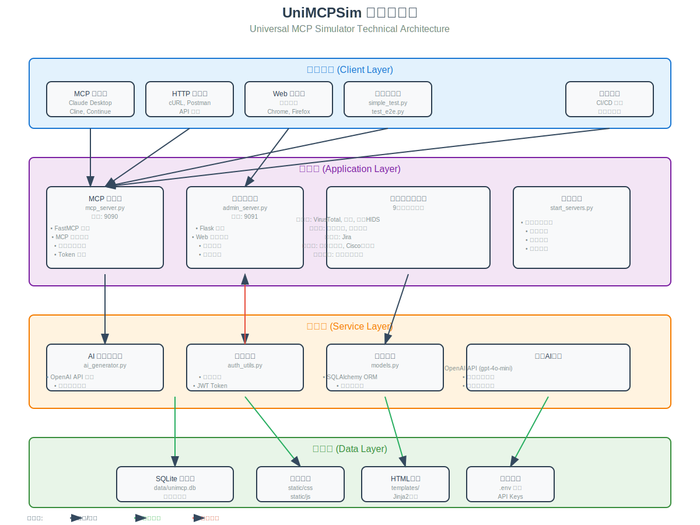

# UniMCPSim 架构设计

本文档详细介绍 UniMCPSim 的系统架构、核心组件和技术实现。

## 系统架构图



## 架构概览

UniMCPSim 采用**双服务器架构**，分别负责 MCP 协议服务和 Web 管理后台：

```
┌─────────────────────────────────────────────────────────┐
│                     UniMCPSim                           │
├─────────────────────────────────────────────────────────┤
│                                                         │
│  ┌──────────────┐              ┌──────────────┐       │
│  │  MCP Server  │              │ Admin Server │       │
│  │  (FastMCP)   │              │   (Flask)    │       │
│  │  Port: 9090  │              │  Port: 9091  │       │
│  └──────┬───────┘              └──────┬───────┘       │
│         │                             │               │
│         │         ┌───────────────────┤               │
│         │         │                   │               │
│         │    ┌────▼─────┐      ┌─────▼────┐          │
│         │    │ Database │      │   Auth   │          │
│         └───►│ (SQLite) │◄─────│  Utils   │          │
│              └────┬─────┘      └──────────┘          │
│                   │                                   │
│              ┌────▼─────┐                            │
│              │    AI    │                            │
│              │Generator │                            │
│              │(OpenAI)  │                            │
│              └──────────┘                            │
│                                                       │
└───────────────────────────────────────────────────────┘
```

## 核心组件

### 1. MCP Server (mcp_server.py)

**职责**: 提供标准 MCP 协议服务，模拟各种产品的 API 接口

**技术栈**: FastMCP (基于 FastAPI)

**端口**: 9090 (默认，可通过环境变量配置)

**主要功能**:
- MCP 协议实现 (initialize, tools/list, tools/call, resources/list, prompts/list)
- 产品专用端点 (`/{Category}/{Product}?token=xxx`)
- Token 认证和权限验证
- 动态工具注册和调用
- AI 响应生成集成

**关键代码路径**:
```
mcp_server.py:62-81   # Token验证和应用获取
mcp_server.py:103-112 # 工具调用处理
mcp_server.py:134-142 # 资源列表返回
```

### 2. Admin Server (admin_server.py)

**职责**: Web 管理后台，提供可视化配置界面

**技术栈**: Flask + Jinja2 + SQLAlchemy

**端口**: 9091 (默认，可通过环境变量配置)

**主要功能**:
- 用户登录和会话管理
- 应用管理 (CRUD操作)
- Token管理和权限绑定
- 提示词模板管理
- 大模型配置 (v2.6.0+)
- 操作日志查看

**API端点**:
```
/admin/login                    # 登录
/admin/                        # 仪表板
/admin/apps                    # 应用管理
/admin/tokens                  # Token管理
/admin/prompts                 # 提示词管理
/admin/llm-config              # 大模型配置 (v2.6.0+)
/admin/logs                    # 操作日志
/admin/api/*                   # REST API
```

### 3. Database Manager (models.py)

**职责**: 数据持久化和ORM模型定义

**技术栈**: SQLAlchemy + SQLite

**数据库文件**: `data/unimcp.db`

**核心模型**:

#### User (用户)
```python
- id: 主键
- username: 用户名 (唯一)
- password_hash: 密码哈希
- created_at: 创建时间
```

#### Token (访问令牌)
```python
- id: 主键
- token: 令牌字符串 (唯一)
- description: 描述
- enabled: 是否启用
- created_at: 创建时间
```

#### Application (应用)
```python
- id: 主键
- category: 分类 (如 Security, IM, Network)
- name: 内部名称 (URL-safe)
- display_name: 显示名称
- description: 详细描述
- actions: 动作定义 (JSON)
- ai_notes: AI生成提示 (v2.5.0+)
- created_at: 创建时间
```

#### AppPermission (应用权限)
```python
- id: 主键
- token_id: Token外键
- app_id: 应用外键
- created_at: 创建时间
```

#### PromptTemplate (提示词模板)
```python
- id: 主键
- name: 模板名称 (唯一)
- display_name: 显示名称
- description: 描述
- template: 模板内容
- variables: 可用变量 (JSON)
- enabled: 是否启用
```

#### LLMConfig (大模型配置) - v2.6.0+
```python
- id: 主键
- api_key: API密钥
- api_base_url: API地址
- model_name: 模型名称
- enable_thinking: 启用思考模式
- enable_stream: 启用流式输出
- created_at: 创建时间
- updated_at: 更新时间
```

#### AuditLog (操作日志)
```python
- id: 主键
- user_id: 用户ID
- action: 操作类型
- target_type: 目标类型
- target_id: 目标ID
- details: 详细信息 (JSON)
- ip_address: IP地址
- created_at: 创建时间
```

### 4. AI Generator (ai_generator.py)

**职责**: 集成 OpenAI API，生成智能响应

**技术栈**: OpenAI Python SDK

**配置优先级** (v2.6.0+):
1. 数据库配置 (通过Web界面)
2. 环境变量配置 (.env文件)

**主要功能**:
- 从数据库或环境变量加载配置
- 动态生成 API 响应
- 支持自定义提示词模板
- 降级处理 (AI不可用时返回默认响应)
- 配置热重载 (无需重启)

**关键方法**:
```python
_load_config()              # 加载LLM配置
reload_config()             # 重新加载配置
generate_response()         # 生成AI响应
_generate_default_response() # 生成默认响应(降级)
```

### 5. Authentication Utils (auth_utils.py)

**职责**: 用户认证和密码管理

**技术栈**: bcrypt + PyJWT

**主要功能**:
- 密码哈希和验证
- JWT Token 生成和验证
- 会话管理

### 6. Logger Utils (logger_utils.py)

**职责**: 统一日志管理

**日志文件**:
- `logs/unimcp_all.log` - 所有级别日志
- `logs/unimcp_error.log` - 错误日志
- `logs/unimcp_debug.log` - 调试日志

**日志级别**: DEBUG, INFO, WARNING, ERROR, CRITICAL

**日志轮转**: 10MB/文件，保留5个备份

## 数据流

### 1. MCP 请求处理流程

```
┌──────────┐
│  Client  │
└────┬─────┘
     │ 1. HTTP Request
     │    POST /{Category}/{Product}?token=xxx
     ▼
┌────────────────┐
│  MCP Server    │
│                │
│ 2. 验证Token    │
│ 3. 获取应用     │
│ 4. 调用动作     │
└────┬───────────┘
     │
     │ 5. 查询数据库
     ▼
┌────────────┐
│  Database  │
└────┬───────┘
     │
     │ 6. 获取提示词模板
     ▼
┌────────────────┐
│  AI Generator  │
│                │
│ 7. 替换变量     │
│ 8. 调用OpenAI   │
│ 9. 生成响应     │
└────┬───────────┘
     │
     │ 10. 返回JSON响应
     ▼
┌──────────┐
│  Client  │
└──────────┘
```

### 2. Web 管理操作流程

```
┌───────────┐
│  Browser  │
└─────┬─────┘
      │ 1. HTTP Request
      │    GET/POST /admin/*
      ▼
┌─────────────────┐
│  Admin Server   │
│                 │
│ 2. 验证会话      │
│ 3. 处理请求      │
└─────┬───────────┘
      │
      │ 4. 数据库操作
      ▼
┌──────────────┐
│  Database    │
└──────┬───────┘
      │
      │ 5. 返回数据
      ▼
┌─────────────────┐
│  Admin Server   │
│                 │
│ 6. 渲染模板      │
└─────┬───────────┘
      │
      │ 7. HTML响应
      ▼
┌───────────┐
│  Browser  │
└───────────┘
```

## 技术栈

### 后端框架
- **FastMCP** - MCP 协议实现
- **Flask** - Web 管理后台
- **SQLAlchemy** - ORM
- **bcrypt** - 密码哈希
- **PyJWT** - JWT Token

### 前端
- **Jinja2** - HTML 模板引擎
- **Monaco Editor** - 代码编辑器
- **原生 JavaScript** - 交互逻辑
- **CSS3** - 样式设计

### AI/ML
- **OpenAI API** - AI响应生成
- 支持兼容 OpenAI 格式的其他模型 (通义千问、DeepSeek等)

### 数据库
- **SQLite** - 轻量级关系数据库

## 配置管理

### 环境变量 (.env)

```bash
# 大模型配置 (v2.6.0+可选，推荐通过Web界面配置)
OPENAI_API_KEY=sk-xxxxx
OPENAI_API_BASE_URL=https://api.openai.com/v1
OPENAI_MODEL=gpt-4o-mini
OPENAI_ENABLE_THINKING=false
OPENAI_STREAM=false

# 服务器端口配置
MCP_SERVER_PORT=9090
ADMIN_SERVER_PORT=9091

# 日志配置
DEBUG=false
LOG_LEVEL=INFO
LOG_DIR=logs
```

### 配置优先级 (v2.6.0+)

```
1️⃣  数据库配置 (Web界面 /admin/llm-config)  [最高优先级]
     ↓
2️⃣  环境变量 (.env文件)                     [备用方案]
```

## 扩展性设计

### 1. 添加新应用

通过 Web 界面或 API 添加：
```python
db_manager.create_application(
    category="Security",
    name="NewScanner",
    display_name="新扫描器",
    description="扫描器描述",
    actions=[...]  # 动作定义
)
```

### 2. 自定义提示词模板

通过 Web 界面或 API 修改：
```python
db_manager.save_prompt_template(
    name="custom_template",
    display_name="自定义模板",
    template="...",
    variables=[...]
)
```

### 3. 添加新的认证方式

扩展 `auth_utils.py`：
```python
def verify_oauth_token(token):
    # OAuth2 验证逻辑
    pass
```

## 性能优化

### 1. 数据库索引
- Token.token (唯一索引)
- Application.category + name (复合索引)
- AppPermission.token_id + app_id (复合索引)

### 2. 响应缓存
当前未实现，可扩展：
```python
# 伪代码
@lru_cache(maxsize=128)
def generate_cached_response(app_name, action, params_hash):
    return ai_generator.generate_response(...)
```

### 3. 连接池
SQLite 使用 SQLAlchemy 连接池管理

## 安全性

### 1. 密码存储
- bcrypt 哈希 (cost=12)
- 自动加盐

### 2. Token 验证
- 每次请求验证 Token 有效性
- Token 与应用权限绑定

### 3. API Key 保护 (v2.6.0+)
- 数据库存储加密
- Web 界面显示脱敏 (sk-xxx***xxx)
- API 返回时脱敏

### 4. 会话管理
- Flask Session (服务端存储)
- 超时自动登出

### 5. 输入验证
- URL-safe 字符验证 (应用名称)
- SQL 注入防护 (参数化查询)
- XSS 防护 (Jinja2 自动转义)

## 监控与日志

### 日志系统
- 多级别日志 (DEBUG/INFO/WARNING/ERROR/CRITICAL)
- 自动轮转 (10MB/文件)
- 操作审计日志 (数据库存储)

### 监控指标
- MCP 请求响应时间
- AI API 调用次数和耗时
- Token 使用统计
- 错误率统计

## 部署建议

### 开发环境
```bash
python start_servers.py
```

### 生产环境
推荐使用 systemd 或 Docker：

```dockerfile
FROM python:3.9
WORKDIR /app
COPY . .
RUN pip install -r requirements.txt
CMD ["python", "start_servers.py"]
```

## 未来规划

- [ ] 添加 PostgreSQL/MySQL 支持
- [ ] 实现响应缓存机制
- [ ] 添加 Prometheus 监控
- [ ] 支持分布式部署
- [ ] 添加 WebSocket 支持
- [ ] 实现 API 速率限制
- [ ] 添加更多认证方式 (OAuth2, LDAP)

---

> **相关文档**: [API 参考](api.md) | [提示词模板系统](prompt_template_system.md)
